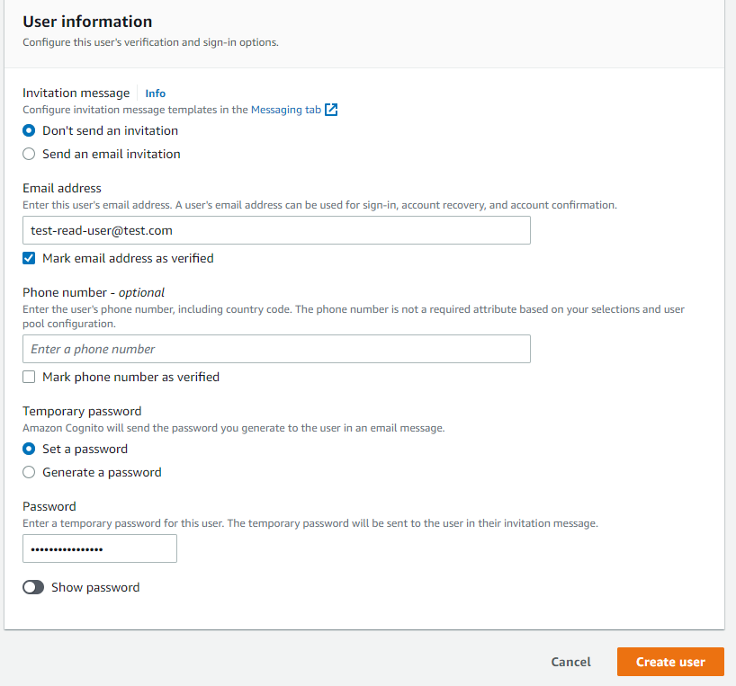
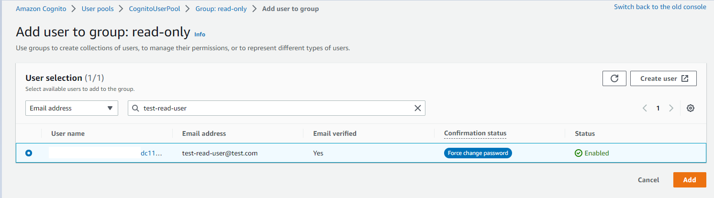
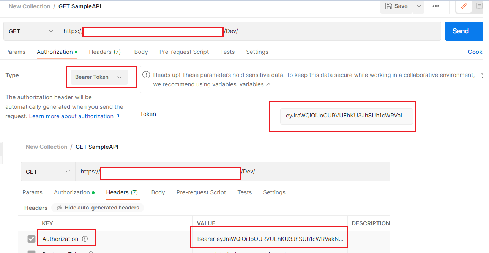

# Fine-grained access control for API Gateway using Lambda Authorizer

- Original: [Fine-grained access control for API Gateway using Lambda Authorizer](https://github.com/aws-samples/aws-cdk-examples/tree/master/csharp/apigateway-cognito-lambda-dynamodb)
- Blazor GitHub: [Sample Blazor Webassembly project Using Cognito Hosted UI Authentication](https://github.com/sravimohan/blazor-webassembly-cognito-hosted-ui-sample)
- [Blazor: Json Web Token (JWT) Authentication Example - Simple](https://www.prowaretech.com/articles/current/blazor/wasm/jwt-authentication-simple#!)
- `TODO`：ローカルで立ち上げた`Blazor`のフロントエンドからサーバー上のAPIへのアクセスで`CORS`を通す
- `APIGateway`の`URL`取得

```shell
aws cloudformation describe-stacks --stack-name ApiGatewayAuthStack --query 'Stacks[].Outputs[?OutputKey==`ApiGwEndpoint`].OutputValue' --output text
```

## How it works

ユーザーは、`API Gateway`へのリクエストで`Cognito`からの`JWT`トークンを提供する必要があります。
`CDK`を介して設定された`AWS Cognito`のホストされた`UI`は、`Cognito`とのやり取りの最も簡単な方法です。
リクエストにヘッダーが存在しない場合、
`API Gateway`は`HTTP401 Unauthorized`ステータスコードを返します。
リクエストヘッダーにトークンが存在する場合、リクエストは検証のために認証ラムダ関数に渡されます。

トークンの署名は、`Cognito`ユーザープールから提供される`JSON Web`キー（`JWK`）を使用して、
`Auth`ラムダによって検証されます。

トークンの署名が検証されたら（構造と有効期限の両方で）、
コードはトークンのクレームを検証し、
トークンに関連付けられたユーザーグループを取得します。
そのユーザーグループに基づいて、
`Lambda`関数は`DynamoDB`テーブルから`API Gateway`のアクセスポリシードキュメントを読み取ります。
ユーザーグループが`DynamoDB`テーブルに存在しない場合、
関数は`API Gateway`に`HTTP 403 Forbidden`応答を返す拒否ポリシーを返します。
ユーザーグループが`DynamoDB`テーブルに存在する場合、
関連するポリシードキュメントが`API Gateway`に返されます。

`Auth Lambda`関数によって返されたポリシーに基づいて、
`API Gateway`はリクエストをバックエンド`Lambda`に転送するか、
`HTTP 403 Forbidden`応答を返すかを決定します。
`JWT`トークンが`JWT`の構造または署名の観点で無効である場合、
認証関数は「`Unauthorized`」例外を発生させ、
これがユーザーに対して`401 Unauthorized`応答に変換されます。

デプロイ手順の一環として`DynamoDB`に登録された値に基づいて、
この構成は2つのユーザーグループを作成します：`read-only`と`read-update-add`。
`read-only`はバックエンドで`GET`のみを呼び出すことができ、
一方で`read-update-add`はバックエンドで`GET`および`POST`操作を実行できます。

## Deploy

```shell
rm -rf dist
dotnet build
dotnet publish src/Lambda/BackendFunction/BackendFunction.csproj -c Release -o dist/BackendFunction
dotnet publish src/Lambda/AuthFunction/AuthFunction.csproj -c Release -o dist/AuthFunction
cdk deploy ApiGatewayAuthStack --app 'dotnet run --project src/CDK/cdk.csproj'
```

- 上記実行の後、`Blazor/wwwroor/appsettings.json`に値を設定する
  - 実行してうまくいかない場合は`Lambda`のログを確認しよう
  - `Blazor`からうまく実行できない場合は以下の手順に沿って`curl`で`Lambda`を実行してみよう
  - ブラウザからの実行では`CORS`の問題もあるため、それも調べよう
- `DynamoDB`に初期値を登録

```shell
aws dynamodb batch-write-item --request-items file://src/DynamoDBData.json
```

## Testing

1. AWSコンソールでCognitoにアクセスする（コンソールでの操作は面倒なため`AWS CLI`での実行法を追記している）。
2. `CognitoUserPool`でユーザーを作る。メールアドレスとパスワードは覚えておこう。
   

```shell
aws cognito-idp list-user-pools --max-results 1 | jq ".UserPools[] | {Id, Name}"
aws cognito-idp list-user-pools --max-results 1 --query 'UserPools[]' --output text
export CognitoId=$(aws cognito-idp list-user-pools --max-results 1 --query 'UserPools[].Id' --output text)
export CognitoUserPoolName=$(aws cognito-idp list-user-pools --max-results 1 --query 'UserPools[].Name' --output text)
```

- ユーザー作成

```shell
export UserName="phasetr@gmail.com"
aws cognito-idp admin-create-user \
  --user-pool-id ${CognitoId} \
  --username ${UserName} \
  --user-attributes Name=email,Value="${UserName}" Name=email_verified,Value=true \
  --message-action SUPPRESS
```

- パスワード設定

```shell
aws cognito-idp admin-set-user-password \
  --user-pool-id ${CognitoId} \
  --username ${UserName} \
  --password 'P@ssw0rd' \
  --permanent
```

- ユーザの情報確認

```shell
aws cognito-idp admin-get-user \
  --user-pool-id ${CognitoId} \
  --username ${UserName}
```

3. `read-only`のユーザーグループに新規ユーザーを追加する。
   

```shell
aws cognito-idp admin-add-user-to-group \
  --user-pool-id ${CognitoId} \
  --username ${UserName} \
  --group-name "USERPOOLGROUP#read-only"
```

- グループ確認

```shell
aws cognito-idp list-users-in-group \
  --user-pool-id ${CognitoId} \
  --group-name "USERPOOLGROUP#read-only"
```

4. ユーザーを追加し、ユーザーグループ`read-update-add`を追加する。

- ユーザー作成

```shell
export UserName="phasetr+admin@gmail.com"
aws cognito-idp admin-create-user \
  --user-pool-id ${CognitoId} \
  --username ${UserName} \
  --user-attributes Name=email,Value="${UserName}" Name=email_verified,Value=true \
  --message-action SUPPRESS
```

- パスワード設定

```shell
aws cognito-idp admin-set-user-password \
  --user-pool-id ${CognitoId} \
  --username ${UserName} \
  --password 'P@ssw0rd' \
  --permanent
```

- ユーザの情報確認

```shell
aws cognito-idp admin-get-user \
  --user-pool-id ${CognitoId} \
  --username ${UserName}
```

```shell
aws cognito-idp admin-add-user-to-group \
  --user-pool-id ${CognitoId} \
  --username ${UserName} \
  --group-name "USERPOOLGROUP#read-update-add"
```

- グループ確認

```shell
aws cognito-idp list-users-in-group \
  --user-pool-id ${CognitoId} \
  --group-name "USERPOOLGROUP#read-update-add"
```

5. 次のコマンドで`CognitoHostedUIUrl`を確認して、
   `CDK`で作った`CognitoHostedUIUrl`の`Cognito`アプリクライアントにアクセスする。

```shell
aws cloudformation describe-stacks --stack-name ApiGatewayAuthStack --query 'Stacks[].Outputs[?OutputKey==`CognitoHostedUIUrl`].OutputValue' --output text
```

6. `read-only`ユーザーグループに割り当てたユーザーでログインする。
7. 上記手順で遷移した`URL`から`access_token`を取得する。以下のコマンドはコールバック`URL`から取得した`access_token`を貼り付けている。

```shell
export AccessToken="<ログイン後URLから取得>"
```

```shell
export AccessToken=""
```

8. `ApiGwEndpoint`の`URL`を取得し、`Authorization`ヘッダーに`access_token`を設定して`GET`リクエストを送信する。
   

```shell
export ApiGwEndpoint=$(aws cloudformation describe-stacks --stack-name ApiGatewayAuthStack --query 'Stacks[].Outputs[?OutputKey==`ApiGwEndpoint`].OutputValue' --output text)
echo ${ApiGwEndpoint}
```

```shell
curl -H "Authorization: Bearer ${AccessToken}" -i ${ApiGwEndpoint}
```

```shell
curl -X POST -H "Content-Type: application/json" -H "Authorization: Bearer ${AccessToken}" -i ${ApiGwEndpoint}
```

9. Confirm that you are returned an 200 Success response
10. Now invoke the same request with the POST verb and the same `access_token`.
11. Confirm that you are returned an HTTP 403 Unauthorized response.
12. Log into the Hosted UI as the second user you created following the steps previously described.
13. Make a GET request to the API Gateway HTTP Endpoint as you did previously,
    this time using the second user's `access_token` for the bearer token.
14. Confirm that you are returned a 200 Success response
15. Make a POST request to the API HTTP Endpoint
16. Confirm you are returned an HTTP 201 Created response
17. Try making a GET or POST request to the endpoint with invalid token
18. Observe that you're returned an HTTP 401 Unauthorized response

## Cleanup

Run the following commands at eventbridge-firehose-s3-cdk folder level

1. Delete the stack

```bash
cdk destroy ApiGatewayAuthStack --app 'dotnet run --project src/CDK/cdk.csproj'
```

2. Confirm the stack has been deleted

```bash
aws cloudformation list-stacks --query "StackSummaries[?contains(StackName,'ApiGatewayAuthStack')].StackStatus"
```

## Related resources

- [Verifying a JSON web token](https://docs.aws.amazon.com/cognito/latest/developerguide/amazon-cognito-user-pools-using-tokens-verifying-a-jwt.html)
- [API GW Resource Policies](https://docs.aws.amazon.com/apigateway/latest/developerguide/apigateway-resource-policies.html)
- [Control access for invoking an API](https://docs.aws.amazon.com/apigateway/latest/developerguide/api-gateway-control-access-using-iam-policies-to-invoke-api.html)
- [API GW Policy statement resource expression format](https://docs.aws.amazon.com/apigateway/latest/developerguide/api-gateway-control-access-using-iam-policies-to-invoke-api.html#api-gateway-iam-policy-resource-format-for-executing-api)
- [Lambda authorizer request format](https://docs.aws.amazon.com/apigateway/latest/developerguide/api-gateway-lambda-authorizer-input.html)
- [Lambda authorizer response format](https://docs.aws.amazon.com/apigateway/latest/developerguide/api-gateway-lambda-authorizer-output.html)
- [Amazon Cognito hosted UI](https://docs.aws.amazon.com/cognito/latest/developerguide/cognito-user-pools-app-integration.html)
- [API Gateway Lambda authorizers](https://docs.aws.amazon.com/apigateway/latest/developerguide/apigateway-use-lambda-authorizer.html)
