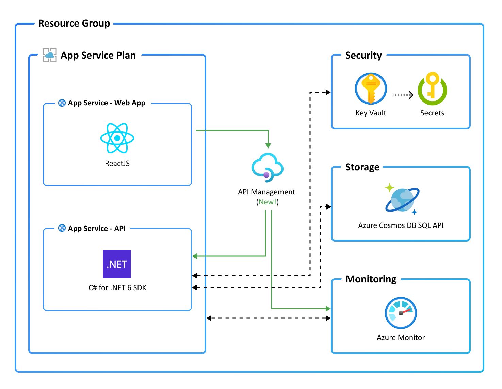

### Enable Additional Features

#### Enable [Azure API Management](https://learn.microsoft.com/azure/api-management/)

This template is prepared to use Azure API Management (aka APIM) for backend API protection and observability. APIM supports the complete API lifecycle and abstract backend complexity from API consumers.

To use APIM on this template you just need to set the environment variable with the following command:

```bash
azd env set USE_APIM true
```

And then execute `azd up` to provision and deploy. No worries if you already did `azd up`! You can set the `USE_APIM` environment variable at anytime and then just repeat the `azd up` command to run the incremental deployment.

Here's the high level architecture diagram when APIM is used:



The frontend will be configured to make API requests through APIM instead of calling the backend directly, so that the following flow gets executed:

1. APIM receives the frontend request, applies the configured policy to enable CORS, validates content and limits concurrency. Follow this [guide](https://learn.microsoft.com/azure/api-management/api-management-howto-policies) to understand how to customize the policy.  
1. If there are no errors, the request is forwarded to the backend and then the backend response is sent back to the frontend.
1. APIM emits logs, metrics, and traces for monitoring, reporting, and troubleshooting on every execution. Follow this [guide](https://learn.microsoft.com/azure/api-management/api-management-howto-use-azure-monitor) to visualize, query, and take actions on the metrics or logs coming from APIM.

> NOTE:
>
> By default, this template uses the Consumption tier that is a lightweight and serverless version of API Management service, billed per execution. Please check the [pricing page](https://azure.microsoft.com/pricing/details/api-management/) for more details.
