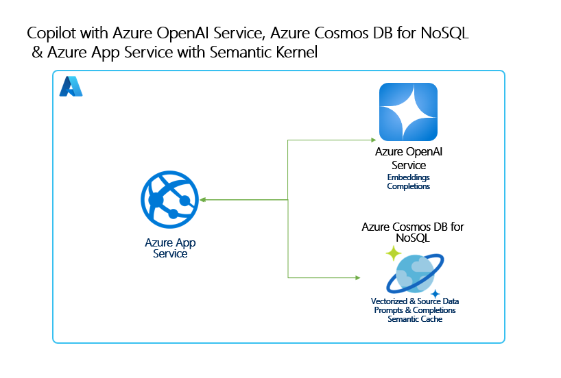

# Build a Copilot app using Azure Cosmos DB for NoSQL, Azure OpenAI Service, Azure App Service and Semantic Kernel

- GitHub: [cosmosdb-nosql-copilot](https://github.com/AzureCosmosDB/cosmosdb-nosql-copilot)
- `App Service`上、いわゆる`Blazor Server`で動く`C#`アプリケーション

2024-07-29時点で`japaneast`では動かないためリージョンは`East US`を指定。

## TODO

2024-07-29で以前の申請から日が近かったせいか、クオータ増量が蹴られた。
`East US`でのクオータ増加のためには`2024-08-30`程度まで待つ必要がある。
申請は`Azure portal`から問い合わせれば適切なページを案内してもらえる。
特に以下の専用フォームから申請すれば良い。

>Azure OpenAI Service のクォータ関連の要求は、[専用フォーム](https://aka.ms/oai/quotaincrease)を使用して申請する必要があります。
>申請及びその後の対応は以下の文書をご拝見いただけますようお願い申し上げます。
><https://learn.microsoft.com/ja-jp/azure/ai-services/openai/quotas-limits>

## 立ち上げコマンド

```shell
azd auth login
azd up
```

```shell
azd down --force
```

## ORIG

This sample application shows how to build a Generative-AI RAG Pattern application using Azure Cosmos DB for NoSQL with its new vector database capabilities with Azure OpenAI Service on Azure App Service. This sample shows both using Native SDKs as well as Semantic Kernel integration. The sample provides practical guidance on many concepts you will need to design and build these types of applications.

## Concepts Covered

This application demonstrates the following concepts and how to implement them:

- The basics of building a highly scalable Generative-AI chat application using Azure Cosmos DB for NoSQL.
- Generating completions and embeddings using Azure OpenAI Service.
- Managing a context window (chat history) for natural conversational interactions with an LLM.
- Manage token consumption and payload sizes for Azure OpenAI Service requests.
- Building a semantic cache using Azure Cosmos DB for NoSQL vector search for improved performance and cost.
- Using the Semantic Kernel SDK for completion and embeddings generation.
- Implementing RAG Pattern using vector search in Azure Cosmos DB for NoSQL on custom data to augment generated responses from an LLM. 

### Architecture Diagram



### User Experience


## Getting Started

### Prerequisites

- Azure subscription. [Start free](https://azure.microsoft.com/free)
- .NET 8 or above. [Download](https://dotnet.microsoft.com/download/dotnet/8.0)
- [Azure Developer CLI](https://aka.ms/azd-install)
- Subscription access to Azure OpenAI service. Start here to [Request Access to Azure OpenAI Service](https://aka.ms/oaiapply)
- Visual Studio, VS Code, GitHub Codespaces or another editor to edit or view the source for this sample.
- Enroll in the [Azure Cosmos DB for NoSQL Vector Search Preview](https://learn.microsoft.com/azure/cosmos-db/nosql/vector-search#enroll-in-the-vector-search-preview-feature)

    #### Vector search Preview details
    This lab utilizes a preview feature, **Vector search for Azure Cosmos DB for NoSQL** which requires preview feature registration. Follow the below steps to register. You must be enrolled before you can deploy this solution:
    
    1. Navigate to your Azure Cosmos DB for NoSQL resource page.
    1. Select the "Features" pane under the "Settings" menu item.
    1. Select for “Vector Search in Azure Cosmos DB for NoSQL”.
    1. Read the description to confirm you want to enroll in the preview.
    1. Select "Enable" to enroll in the Vector Search preview.

### Instructions

1. Run the following command to download this project code:

    ```bash
    azd init -t AzureCosmosDB/cosmosdb-nosql-copilot
    ```

1. Open a terminal and navigate to the /infra directory in this solution.

1. Log in to AZD.
    
    ```bash
    azd auth login
    ```

1. Deploy the services to Azure, build your container, and deploy the application.
    
    ```bash
    azd up
    ```

### Quickstart

This solution has a number of quickstarts than you can run through to learn about the features in this sample and how to implement them yourself.

Please see [Quickstarts](quickstart.md)


## Clean up

1. Open a terminal and navigate to the /infra directory in this solution.

1. Type azd down
    
    ```bash
    azd down
    ```

## Resources

To learn more about the services and features demonstrated in this sample, see the following:

- [Azure Cosmos DB for NoSQL Vector Search announcement](https://aka.ms/CosmosDBDiskANNBlog/)
- [Azure OpenAI Service documentation](https://learn.microsoft.com/azure/cognitive-services/openai/)
- [Semantic Kernel](https://learn.microsoft.com/semantic-kernel/overview)
- [Azure App Service documentation](https://learn.microsoft.com/azure/app-service/)
- [ASP.NET Core Blazor documentation](https://dotnet.microsoft.com/apps/aspnet/web-apps/blazor)
