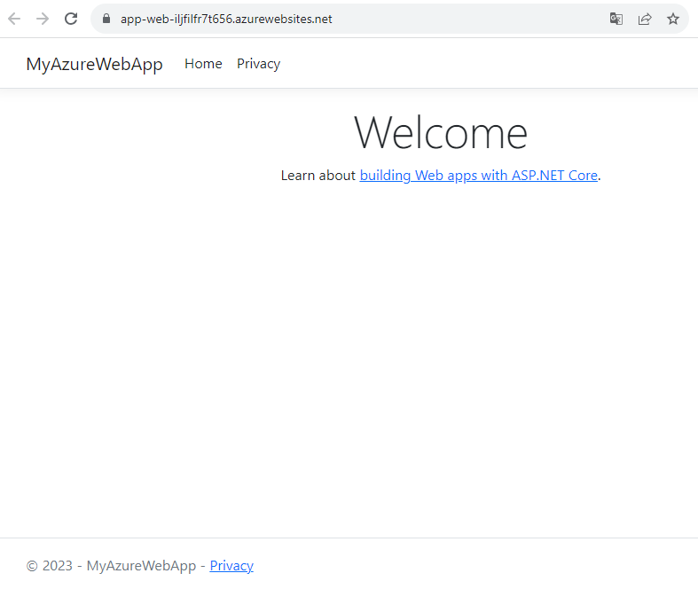

# quickstart-deploy-aspnet-core-app-service

- `App Service`に`C#`の`Razor Pages`のアプリを展開している
- オリジナルの[GitHubリポジトリ](https://github.com/Azure-Samples/quickstart-deploy-aspnet-core-app-service)

```shell
azd auth login
azd up
```

```shell
azd down
```

## Original

Quickstart-deploy-aspnet-core-app-service is a demo project showcasing what you can get your application up on Azure using [Azure Developer CLI](https://learn.microsoft.com/en-us/azure/developer/azure-developer-cli/overview)(azd).

## Prerequisites

The following prerequisites are required to use this application.  Please ensure that you have them all installed locally.

- [Azure Developer CLI](https://aka.ms/azure-dev/install)
  - Windows:

    ```powershell
    powershell -c "powershell -ex AllSigned -c "Invoke-RestMethod 'https://aka.ms/install-azd.ps1' | Invoke-Expression""
    ```

  - Linux/MacOS:

    ```bash
    curl -fsSL https://aka.ms/install-azd.sh | bash 
    ```

- [.Net SDK 8.0](https://dotnet.microsoft.com/en-us/download/dotnet/8.0)

- [Git (2.36.1+)](https://git-scm.com/)

- [Docker](https://docs.docker.com/get-docker/)

### Quickstart

The fastest way for you to get this application up and running on Azure is to use the `azd up` command. This single command will create and configure all necessary Azure resources.

>Notes: you can run the project in your local environment or [DevContainer](https://code.visualstudio.com/docs/devcontainers/containers).

Run the following commands to initialize the project, provision Azure resources, and deploy the application code.

```bash
# Download the repo assets from GitHub and initialize azd locally
azd init -t Azure-Samples/Deploy-ASP.NET-to-AppService

# Login to azure
azd auth login

# Provision and deploy to Azure
azd up
```

You will be prompted for the following information:

- `Environment Name`: This will be used as a prefix for all your Azure resources, make sure it is globally unique and under 15 characters.
- `Azure Subscription`: The Azure Subscription where your resources will be deployed.
- `Azure Location`: The Azure location where your resources will be deployed

When you are finished, you will have an ASP.NET web app deployed to the cloud. Click on the web link and you will see the page as shown below:



### Configuring Github Workflow

This will allow you to configure a service principal in azure and federate it to your github account. After you finish the configuration, you can see a set of variables set in the repository.

```bash
azd pipeline config
```

### Clean up resources

In the preceding steps, you created Azure resources in a resource group. If you don't expect to need these resources in the future, delete the resource group by running the following command:

```bash
azd down
```

### Additional azd commands

The Azure Developer CLI includes many other commands to help with your Azure development experience. You can view these commands at the terminal by running `azd help`. You can also view the full list of commands on our [Azure Developer CLI command](https://aka.ms/azure-dev/ref) page.
